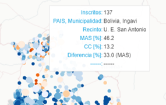
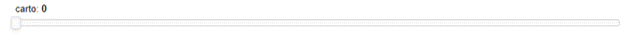
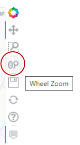
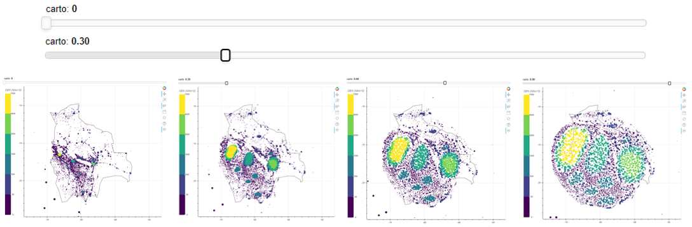

# **Guía de uso** 
## Gráfica Carto MAS-CC:
Es el mapa comparativo entre las dos fuerzas políticas con mayor intención de voto (de acuerdo con las encuestas y tendencias difundidas en diversos medios de comunicación). Mide principalmente la diferencia de puntos porcentuales que tiene un partido por sobre el otro.
* Cada punto representa un recinto electoral.
* El tamaño de cada círculo representa la cantidad de votantes en cada recinto, mientras más grande, más densamente poblado.
* Al colocar el cursor sobre cualquier punto aparecerá un cuadro con la siguiente información:  
  
    * Inscritos: número de votantes inscritos en ese recinto electoral
    * País, municipalidad: país y municipio al que pertenece ese recinto 
    * Recinto: nombre del recinto electoral
    * MAS [%]: porcentaje de votos para el MAS
    * CC [%]: porcentaje de votos para CC
    * Diferencia: la cantidad de puntos porcentuales por el que gana un partido al otro. 
* En algunas ocasiones, al colocar el cursor sobre algún punto del mapa, verá más de un recinto electoral. Puede acercarse con el “Wheel zoom” para encontrar la información sobre un solo recinto.
* El color de cada punto y su intensidad (más oscuro o claro) corresponde a la diferencia de puntos porcentuales que le saca un partido político al otro, es decir cuanto más oscuro el azul, más diferencia a favor del MAS en ese recinto, cuanto más anaranjado, más diferencia a favor de CC.
* Slider (carto):
  
Encima de la gráfica existe una línea horizontal (slider) que va de 0 a 1. Cuando está en 0 (totalmente a la izquierda), muestra el lugar exacto de cada recinto electoral en el mapa de Bolivia, la densidad (tamaño del círculo) y la preferencia electoral (color e intensidad). A medida que se desliza hacia la derecha, el mapa se deforma y los recintos electorales se separan para que observarlos de manera individual sea más fácil, manteniendo los mismos elementos descritos anteriormente.
* Wheel zoom: 
  
haga clic sobre el ícono para activarlo, coloque el cursor en cualquier parte del mapa, gire la rueda del mouse hacia adelante para acercarse y hacia atrás para alejarse. Si se aleja lo suficiente, puede observar la votación en recintos electorales ubicados en otros países. 
  

## Carto MAS-CC con correspondencia al mapa real:
Es la correspondencia entre el mapa que muestra principalmente la diferencia de puntos porcentuales que tienen las dos principales fuerzas políticas (izquierda), con el lugar exacto en el mapamundi (derecha). 
Permite ubicar el lugar exacto en el mapamundi en el que se encuentra el recinto electoral que seleccione en la izquierda, donde se pueden observar los detalles de dicho recinto.

* Cada punto corresponde a un recinto electoral, su color está relacionado con la densidad de votantes (votos por kilómetro cuadrado), y su tamaño con la cantidad de votos (mientras más grande, más votos). 
* Cuando se desliza el slider (carto), el mapa de la izquierda se deforma separando gradualmente los recintos electorales para una mejor visualización, mientras que el mapa de la derecha mantiene sus proporciones. Si coloca el cursor en algún punto del mapa de la izquierda (no importa cuán deformado esté), puede ver exactamente dónde se encuentra ese recinto en el mapamundi real de la derecha.

## Gráfica Carto densidad:
* Cada punto corresponde a un recinto electoral, su color está relacionado con la densidad de votantes (votos por kilómetro cuadrado), y su tamaño con la cantidad de personas inscritas (mientras más grande, más votos). 
* Mueva el slider de izquierda a derecha y viceversa (carto) para ver la deformación.
